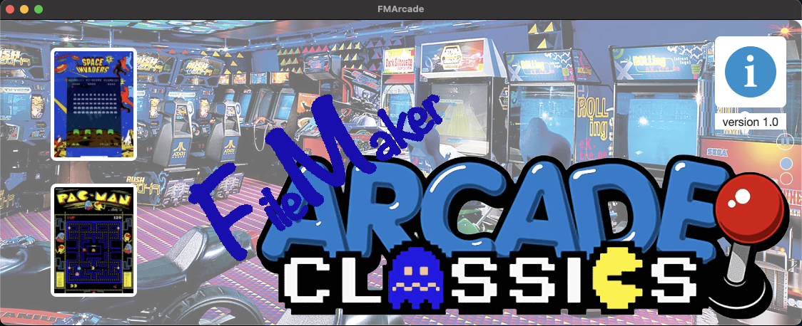
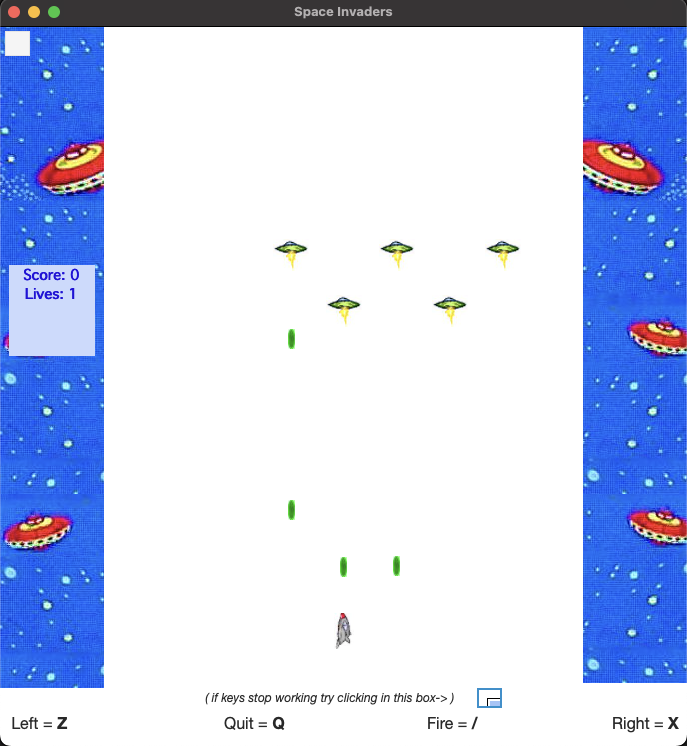
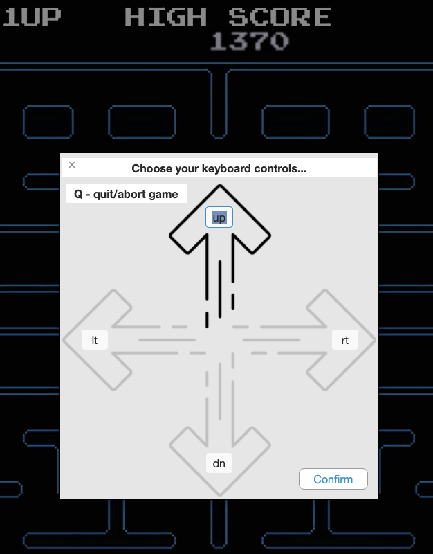

# FMArcade

#### A FileMaker Pro & JavaScript integration file

FileMaker Arcade games, containing Space Invaders, and Pac-Man

#### Cost

Free.
Completely unlocked.
Ready for you to explore.

#### Usage

1. Download and open the zipped FileMaker Pro database

#### Dependancies

This database uses no additional dependancies.

A 3rd party library "jQuery" (used only for keyboard inputs) is embedded in some of the Scripts, but it is already included and no additional installations or internet connection is necessary.
